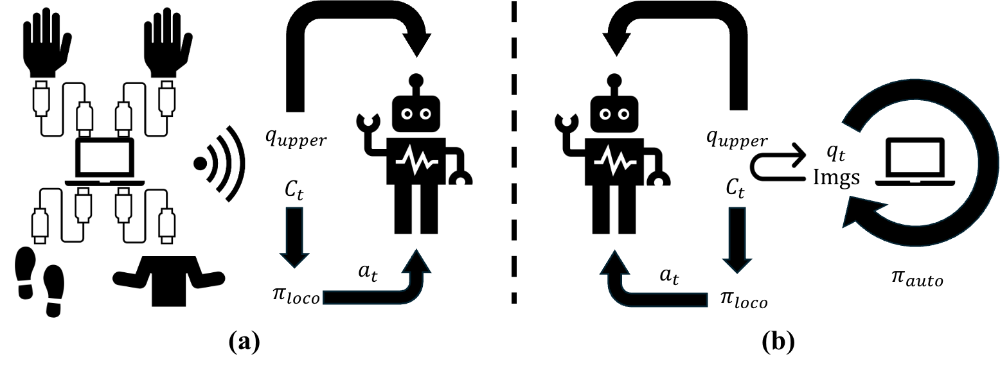

<br>
<p align="center">
<h1 align="center"><strong>HOMIE: 基于同构外骨骼驾驶舱的人形机器人移动操作（部署版）</strong></h1>
  <p align="center">
    <a href='https://www.qingweiben.com' target='_blank'>Qingwei Ben*</a>, <a href='https://trap-1.github.io/' target='_blank'>Feiyu Jia*</a>, <a href='https://scholar.google.com/citations?user=kYrUfMoAAAAJ&hl=zh-CN' target='_blank'>Jia Zeng</a>, <a href='https://jtdong.com/' target='_blank'>Junting Dong</a>, <a href='https://dahua.site/' target='_blank'>Dahua Lin</a>, <a href='https://oceanpang.github.io/' target='_blank'>Jiangmiao Pang</a>
    <br>
    * 同等贡献
    <br>
    上海人工智能实验室 & 香港中文大学
    <br>
  </p>
</p>

<div id="top" align="center">

[](https://arxiv.org/abs/2502.13013)
[](https://homietele.github.io/)



</div>

## 📋 目录

- [🏠 简介](#-description)
- [📚 使用方法](#-use)
- [🔗 引用](#-citation)
- [📄 许可证](#-license)
- [👏 致谢](#-acknowledgements)

## 🏠 简介
<a name="-description"></a>
本仓库是 "HOMIE: 基于同构外骨骼驾驶舱的人形机器人移动操作" 的官方部署实现。它需要一台配备 `Dex-3 机械手` 的 `Unitree G1` 机器人和一台个人电脑。机器人与PC之间的所有通信都通过Wi-Fi进行。我们的代码基于 [Walk-These-Ways](https://github.com/Improbable-AI/walk-these-ways) 和 [Unitree SDK2](https://github.com/unitreerobotics/unitree_sdk2)。我们的[硬件系统](https://github.com/OpenRobotLab/HomieHardware)也已开源，您可以先参考它来重新实现遥操作系统。一旦您成功构建了系统，您可以按照[使用方法](#-use)中的说明进行操作。为了简化我们驾驶舱的使用，我们仅提供了一个名为 `deploy.onnx` 的示例检查点。

## 📚 使用方法
<a name="-use"></a>

### Unitree G1
**注意：** 建议您将屏幕、键盘和鼠标连接到 Unitree G1，以便将其板载计算机作为电脑使用。

首先，您需要在 Unitree G1 的 Nvidia Jetson Orin 上安装 `PyTorch`，这与普通 Ubuntu PC 上的安装过程不同。对于此步骤，请参考官方[说明](https://docs.nvidia.com/deeplearning/frameworks/install-pytorch-jetson-platform/index.html)。

然后，您可以使用任何方式将此代码放到 Orin 上并进入目录。通过运行以下命令安装所需的包：
```
pip install -r requirements.txt
```
为了控制机器人，我们使用基于 C++ 的 Unitree SDK2，这意味着您应该首先编译用于 `Unitree G1` 的 `g1_control.cpp` 和用于 `Dex-3` 的 `hand_control.cpp`。我们已经为您准备了所需的 `CMakeLists.txt`，因此您只需要运行以下命令：
```
cd unitree_sdk2
rm -rf build
mkdir build && cd build
cmake ..
make
```
然后可运行的二进制文件将在 `unitree_sdk2/build/bin` 目录中。
您还需要通过运行以下命令安装 `g1_gym_deploy`：
```
cd g1_gym_deploy && pip install -e .
```

### 部署
**在部署之前，请运行 L1+A L2+R2 L2+A L2+B 来关闭 G1 的初始控制进程，如果成功，您将看到机器人在 L2+A 后抬起手臂，在 L2+B 后失去力控。**

对于 TCP 通信，您应该通过运行以下命令确定您的 PC 和机器人的 IP 地址：
```
ifconfig | grep inet
```
在代码中将 IP 地址设置为正确的值。

A. 在 `robot` 上运行手部控制程序（机器人终端 3）：
```
cd unitree_sdk2/build/bin && ./hand_control
```
B. 在 `robot` 上运行机器人控制程序（机器人终端 4）：
```
cd unitree_sdk2/build/bin && ./g1_control eth0 (或 eth1)
```
C. 在 `robot` 上运行推理线程以使策略控制机器人（机器人终端 5）：
```
python g1_gym_deploy/scripts/deploy_policy.py
```
D. 将机器人放在地面上后，按下操纵杆的 `R2` 按钮，使机器人站立在地面上，然后再次按下 `R2`。

***注意：*** 我们强烈建议您在真正理解所有文件的功能后再进行系统部署，否则可能会遇到一些问题。

## 🔗 引用

如果您觉得我们的工作有帮助，请引用：

```bibtex
@article{ben2025homie,
  title={HOMIE: Humanoid Loco-Manipulation with Isomorphic Exoskeleton Cockpit},
  author={Ben, Qingwei and Jia, Feiyu and Zeng, Jia and Dong, Junting and Lin, Dahua and Pang, Jiangmiao},
  journal={arXiv preprint arXiv:2502.13013},
  year={2025}
}
```

</details>

## 📄 许可证

HOMIE 的所有代码均采用 <a rel="license" href="http://creativecommons.org/licenses/by-nc-sa/4.0/">知识共享署名-非商业性使用-相同方式共享 4.0 国际许可协议</a><a rel="license" href="http://creativecommons.org/licenses/by-nc-sa/4.0/"></a>。在询问我们团队之前，严禁将其用于商业目的。

## 👏 致谢


- [Walk-These-Ways](https://github.com/leggedrobotics/rsl_rl): 我们的机器人部署代码基于 `walk-these-ways`。
- [Unitree SDK2](https://github.com/leggedrobotics/rsl_rl): 我们使用 `Unitree SDK2` 库来控制机器人。

## 注意
这里我们仅包含 HOMIE 的 G1 策略部署代码。如果您想访问完整代码，请填写[此表单](https://docs.google.com/forms/d/e/1FAIpQLSeETDUR9w7qkWpIgSPwpT6408cPDgaNUYhDZUeUm3qMdk2L9w/viewform?usp=header)。
