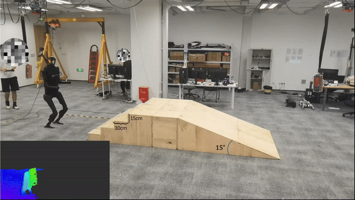

# 高度图映射（Elevation Mapping）人形机器人版

## 概述



本仓库提供了使用单个 MID-360 激光雷达为人形机器人生成高度图的实现。它主要基于 [Robot-Centric Elevation Mapping](https://github.com/ANYbotics/elevation_mapping) 和 [Fast Lio Mid360](https://github.com/SylarAnh/fast_lio_mid360)。该包在里程计坐标系中生成稳定、完整、平滑的高度图，可以进一步使用来自激光雷达、IMU 和机器人位姿的数据将其转换到 `torso_link` 坐标系。

**注意**：本仓库的贡献主要在工程实现方面，大部分功劳应归功于下面列出的原始研究论文。如果您觉得本仓库有用，请考虑引用它们：

```bibtex
@article{fankhauser_probabilistic_2018,
	title = {Probabilistic Terrain Mapping for Mobile Robots With Uncertain Localization},
	volume = {3},
	url = {https://ieeexplore.ieee.org/document/8392399/},
	doi = {10.1109/LRA.2018.2849506},
	pages = {3019--3026},
	journaltitle = {{IEEE} Robotics and Automation Letters},
	author = {Fankhauser, Peter and Bloesch, Michael and Hutter, Marco},
	date = {2018-10}
}

@misc{xu_fast-lio_2021,
	title = {{FAST}-{LIO}: A Fast, Robust {LiDAR}-inertial Odometry Package by Tightly-Coupled Iterated Kalman Filter},
	url = {http://arxiv.org/abs/2010.08196},
	doi = {10.48550/arXiv.2010.08196},
	publisher = {{arXiv}},
	author = {Xu, Wei and Zhang, Fu},
	date = {2021-04-14}
}
```

本仓库已应用于以下论文：
```bibtex
@misc{long_learning_2024,
	title = {Learning Humanoid Locomotion with Perceptive Internal Model},
	url = {http://arxiv.org/abs/2411.14386},
	doi = {10.48550/arXiv.2411.14386},
	publisher = {{arXiv}},
	author = {Long, Junfeng and Ren, Junli and Shi, Moji and Wang, Zirui and Huang, Tao and Luo, Ping and Pang, Jiangmiao},
	date = {2024-11-21},
}

@misc{wang_beamdojo_2025,
	title = {{BeamDojo}: Learning Agile Humanoid Locomotion on Sparse Footholds},
	url = {http://arxiv.org/abs/2502.10363},
	doi = {10.48550/arXiv.2502.10363},
	publisher = {{arXiv}},
	author = {Wang, Huayi and Wang, Zirui and Ren, Junli and Ben, Qingwei and Huang, Tao and Zhang, Weinan and Pang, Jiangmiao},
	date = {2025-02-14},
}

@misc{ren_vb-com_2025,
	title = {{VB}-Com: Learning Vision-Blind Composite Humanoid Locomotion Against Deficient Perception},
	url = {http://arxiv.org/abs/2502.14814},
	doi = {10.48550/arXiv.2502.14814},
	publisher = {{arXiv}},
	author = {Ren, Junli and Huang, Tao and Wang, Huayi and Wang, Zirui and Ben, Qingwei and Pang, Jiangmiao and Luo, Ping},
	date = {2025-02-20},
}
```

## 功能说明

### 核心功能

1. **高度图生成**：从激光雷达点云数据生成 2.5D 高度图（elevation map）
2. **实时处理**：实时处理点云数据并更新高度图
3. **多传感器融合**：融合 LiDAR、IMU 和机器人位姿数据
4. **坐标系转换**：支持从里程计坐标系转换到机器人本体坐标系（torso_link）

### 主要组件

1. **fast_lio_mid360**：LiDAR-IMU 里程计，提供点云和位姿估计
2. **elevation_mapping**：核心高度图生成模块
3. **pose_publisher**：发布机器人位姿信息
4. **辅助工具**：点云过滤、坐标系发布等

## 安装

### 系统要求

- **ROS 版本**：ROS Noetic
- **操作系统**：Ubuntu 20.04
- **硬件**：MID-360 激光雷达 + IMU

### 依赖项

本包基于机器人操作系统（[ROS](http://www.ros.org)），需要先[安装 ROS](http://wiki.ros.org)。

此外，还依赖以下包：

- [Grid Map](https://github.com/anybotics/grid_map)（移动机器人的网格地图库）
- [kindr](http://github.com/anybotics/kindr)（机器人运动学和动力学库）
- [Point Cloud Library (PCL)](http://pointclouds.org/)（点云处理库）
- [Eigen](http://eigen.tuxfamily.org)（线性代数库）
- [Livox Ros Driver](https://github.com/Livox-SDK/livox_ros_driver) 或 [Livox Ros Driver2](https://github.com/Livox-SDK/livox_ros_driver2)（连接 Livox 激光雷达的驱动包）

详细的安装说明请参考各包的官方文档。

**安装 Livox ROS Driver2**：请参考 [Livox ROS Driver2 官方文档](https://github.com/Livox-SDK/livox_ros_driver2) 进行安装和配置。


### 编译本仓库

```bash
# 克隆仓库
cd ~/catkin_ws/src
git clone https://github.com/smoggy-P/elevation_mapping_humanoid.git

# 修改驱动名称（使用 Livox ROS Driver2）
cd elevation_mapping_humanoid
sed -i 's/livox_ros_driver/livox_ros_driver2/g' fast_lio_mid360/src/preprocess.h
sed -i 's/livox_ros_driver/livox_ros_driver2/g' fast_lio_mid360/src/preprocess.cpp
sed -i 's/livox_ros_driver/livox_ros_driver2/g' fast_lio_mid360/src/laserMapping.cpp

# 编译
cd ~/catkin_ws
catkin_make
source devel/setup.bash
```

## 运行

### 启动系统

```bash
source ~/catkin_ws/devel/setup.bash
roslaunch elevation_mapping_demos realsense_demo.launch
```

启动后会自动打开 RViz 显示高度图（已在 `visualization.launch` 中配置）。

### 验证数据流

```bash
# 检查话题
rostopic hz /elevation_mapping/elevation_map
rostopic echo /elevation_map_fused_visualization/elevation_cloud -n 1
```

## 适配到您的机器人

要将本包适配到您的机器人，请修改 [publish_tf.py](./fast_lio_mid360/script/publish_tf.py) 脚本中的静态变换，以匹配您的机器人配置。

## 工作流程

1. **LiDAR 数据采集**：MID-360 激光雷达采集点云数据
2. **里程计估计**：Fast LIO 使用 LiDAR-IMU 融合估计机器人位姿
3. **点云处理**：点云过滤和坐标系转换
4. **高度图生成**：Elevation Mapping 模块融合点云数据生成高度图
5. **发布高度图**：高度图发布到 ROS topic `/elevation_mapping/elevation_map`

## ROS 话题

### 订阅的话题

- `/cloud_registered`：注册后的点云数据（来自 Fast LIO，类型：`sensor_msgs/PointCloud2`）
- `/odometry`：机器人里程计信息（类型：`nav_msgs/Odometry`）
- `/pose`：机器人位姿信息（类型：`geometry_msgs/PoseWithCovarianceStamped`）

### 发布的话题

- `/elevation_mapping/elevation_map`：生成的高度图（`grid_map_msgs/GridMap`）
- `/elevation_map_fused_visualization/elevation_cloud`：高度图点云（`sensor_msgs/PointCloud2`）
  - 坐标系：`odom_corrected`
  - Z 坐标：地面高度
  - **用于 Python 控制代码订阅**

## 集成到策略网络

订阅 `/elevation_map_fused_visualization/elevation_cloud` 话题获取高度图点云：

```python
import rospy
from sensor_msgs.msg import PointCloud2
import sensor_msgs.point_cloud2 as pc2

rospy.init_node('heightmap_subscriber')
sub = rospy.Subscriber('/elevation_map_fused_visualization/elevation_cloud', 
                       PointCloud2, callback)
```

**注意**：
- 点云坐标系：`odom_corrected`
- 点云 Z 坐标：地面高度
- 计算观测：`高度值 = 机器人 Z - 地面高度`
- 网格尺寸：15×15 = 225 维

详细实现参考 `g1_gym_deploy` 包中的 `heightmap_subscriber.py` 和 `heightmap_processor.py`。

